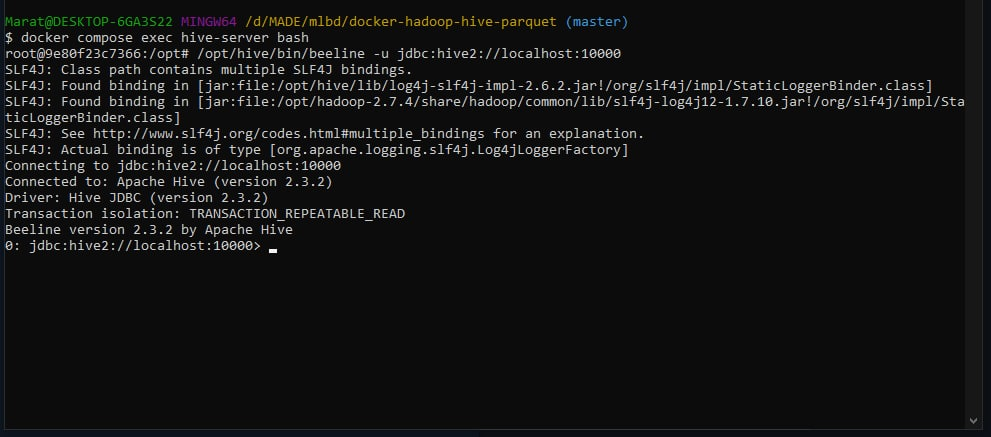
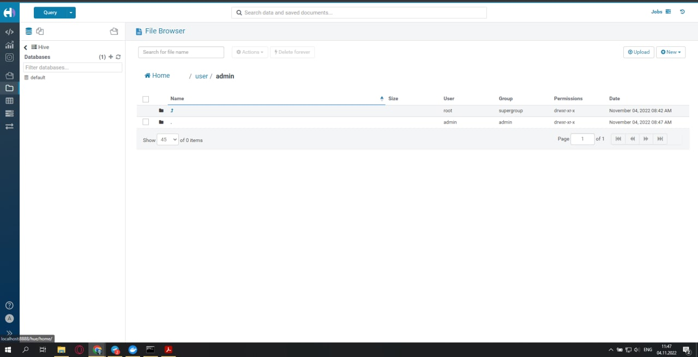
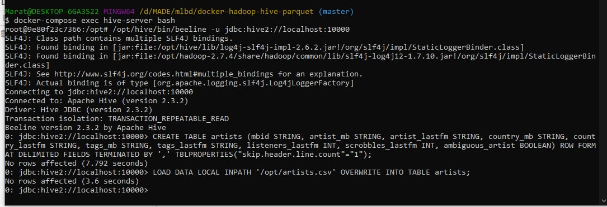
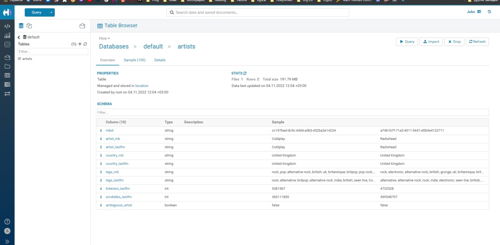
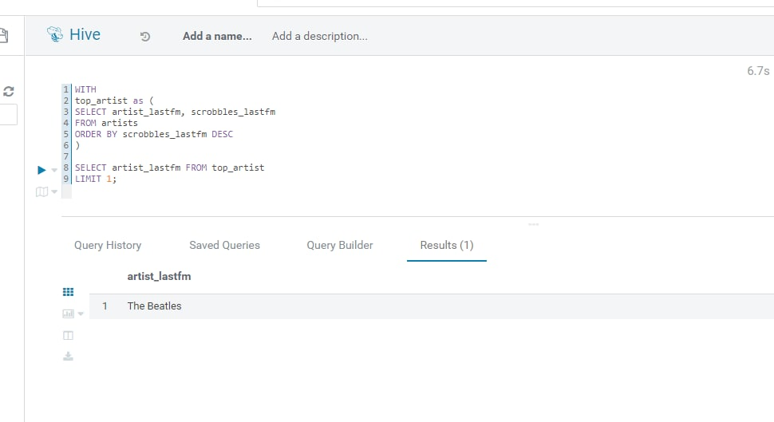
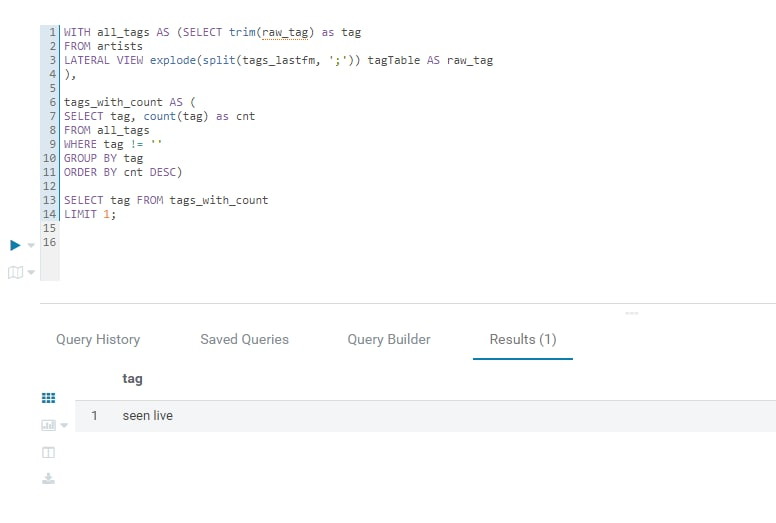
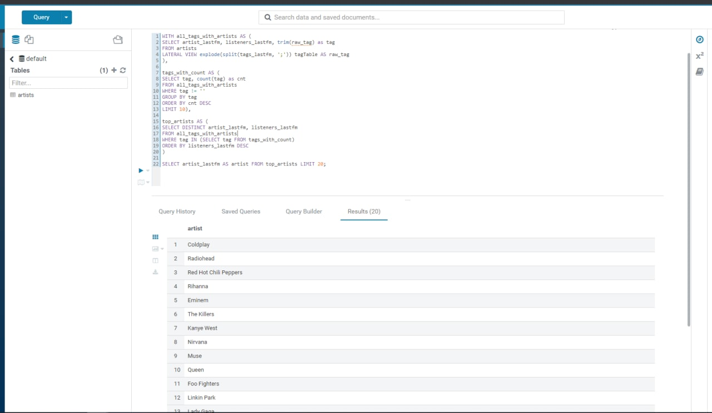
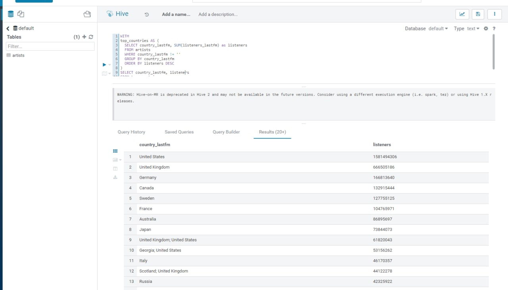
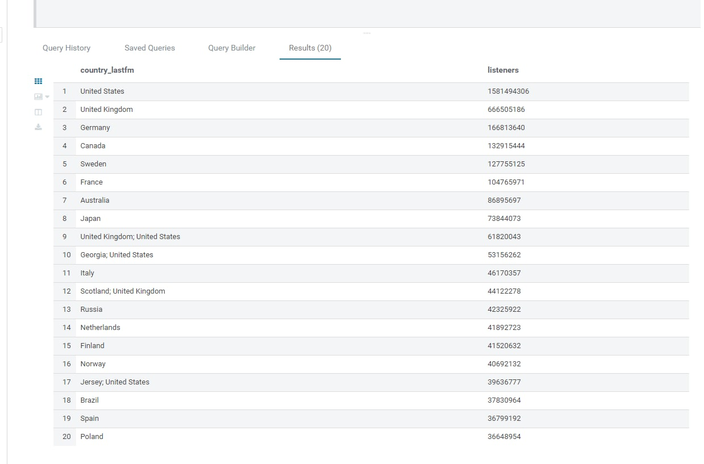

## Блок 1. Развёртывание локального Hive

- Для развертывания локального Hive была использована конфигурация [из лекции](https://github.com/tech4242/docker-hadoop-hive-parquet)
- Для подключения к Hive использовались Beeline и Hue, который разворачивался из того же репозитория
 
  - подкючение через Beeline:
  
  - подкючение через Hue:
  

## Блок 2.1 Работа с Hive

- При загрузке таблицы через Hue возникала ошибка и не позволяла загрузить полностью исходный [датасет](https://www.kaggle.com/pieca111/music-artists-popularity).
  
- Загрузка производилась через Beeline 
  
  
- Скрипт создания таблицы:
```bash
docker cp artists.csv docker-hadoop-hive-parquet_hive-server_1:/opt
docker-compose exec hive-server bash

/opt/hive/bin/beeline -u jdbc:hive2://localhost:10000

CREATE TABLE artists (mbid STRING, artist_mb STRING, artist_lastfm STRING, country_mb STRING, country_lastfm STRING, tags_mb STRING, tags_lastfm STRING, listeners_lastfm INT, scrobbles_lastfm INT, ambiguous_artist BOOLEAN) ROW FORMAT DELIMITED FIELDS TERMINATED BY ',' TBLPROPERTIES("skip.header.line.count"="1");

LOAD DATA LOCAL INPATH '/opt/artists.csv' OVERWRITE INTO TABLE artists;
```
- Результат создания таблицы
  

## Блок 2.2 Запросы с Hive

- Исполнитель с максимальным числом скробблов
```sql
WITH top_artist as (
    SELECT artist_lastfm, scrobbles_lastfm 
    FROM artists
    ORDER BY scrobbles_lastfm DESC
)

SELECT artist_lastfm FROM top_artist
LIMIT 1;
```

- Самый популярный тэг на ластфм
```sql
WITH all_tags AS (
    SELECT trim(raw_tag) as tag
    FROM artists
    LATERAL VIEW explode(split(tags_lastfm, ';')) tagTable AS raw_tag
),

tags_with_count AS (
    SELECT tag, count(tag) as cnt
    FROM all_tags 
    WHERE tag != ''
    GROUP BY tag
    ORDER BY cnt DESC
)

SELECT tag FROM tags_with_count
LIMIT 1;
```

- Самые популярные исполнители 10 самых популярных тегов ластфм
```sql
WITH all_tags_with_artists AS (
    SELECT artist_lastfm, listeners_lastfm, trim(raw_tag) as tag
    FROM artists
    LATERAL VIEW explode(split(tags_lastfm, ';')) tagTable AS raw_tag
),

tags_with_count AS (
    SELECT tag, count(tag) as cnt
    FROM all_tags_with_artists 
    WHERE tag != ''
    GROUP BY tag
    ORDER BY cnt DESC
    LIMIT 10
),

top_artists AS (
    SELECT DISTINCT artist_lastfm, listeners_lastfm
    FROM all_tags_with_artists
    WHERE tag IN (SELECT tag FROM tags_with_count)
    ORDER BY listeners_lastfm DESC
)

SELECT artist_lastfm AS artist FROM top_artists LIMIT 20;
```

- Топ 20 стран артистов по прослушиваниям
```sql
WITH top_countries AS (
  SELECT country_lastfm, SUM(listeners_lastfm) as listeners 
  FROM artists
  WHERE country_lastfm != ''
  GROUP BY country_lastfm
  ORDER BY listeners DESC
)
SELECT country_lastfm, listeners
FROM top_countries 
LIMIT 20;
```


